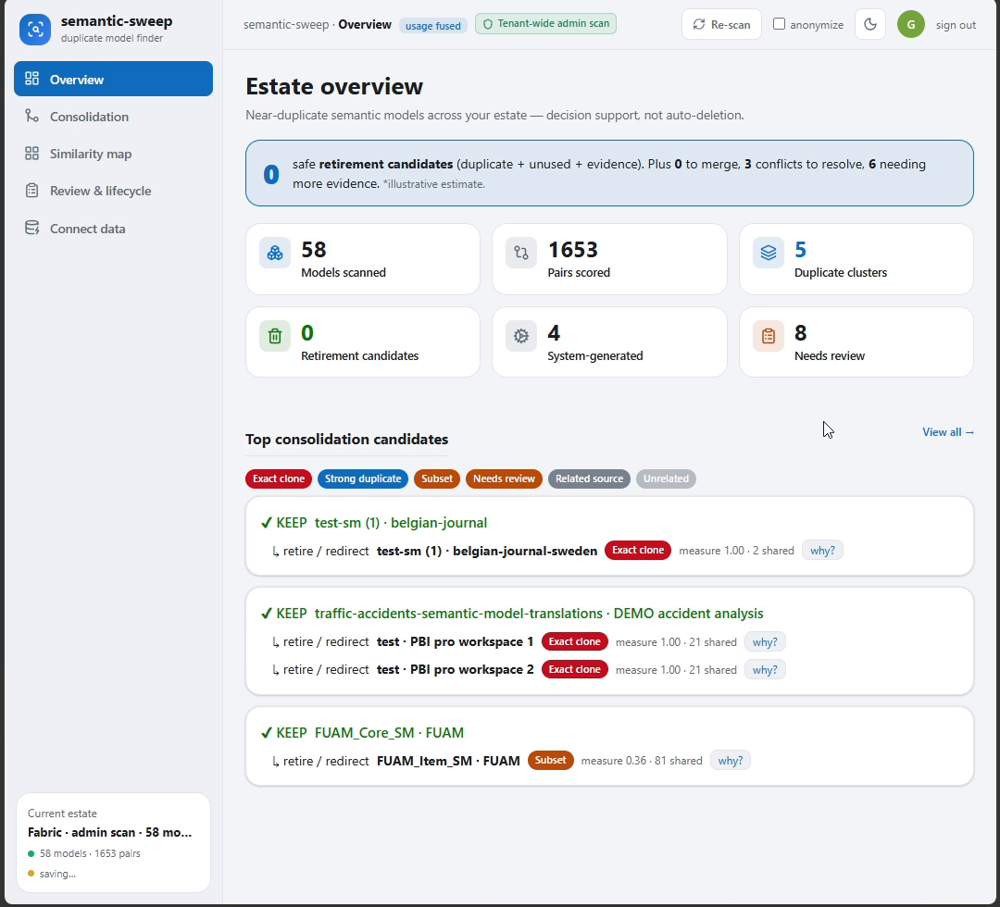
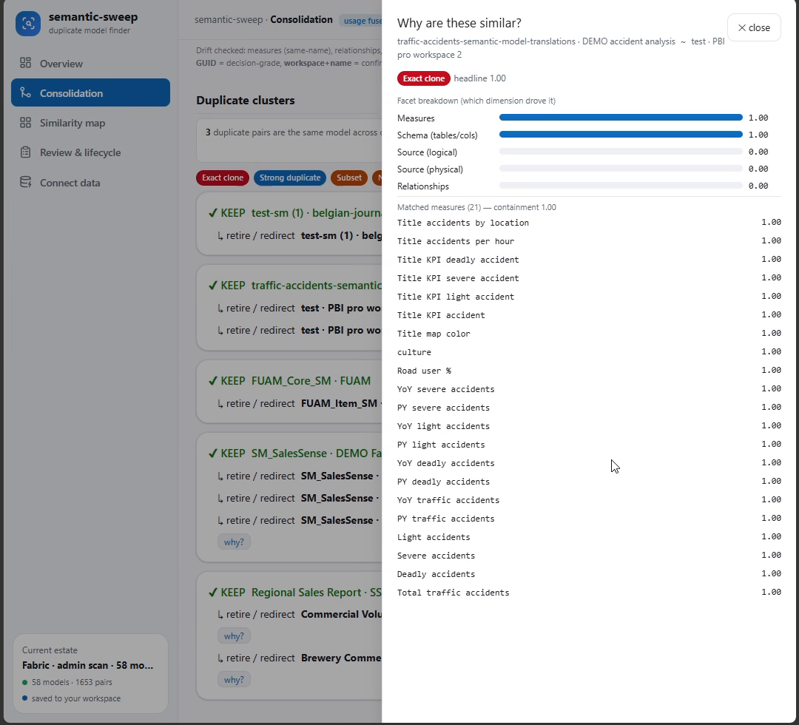
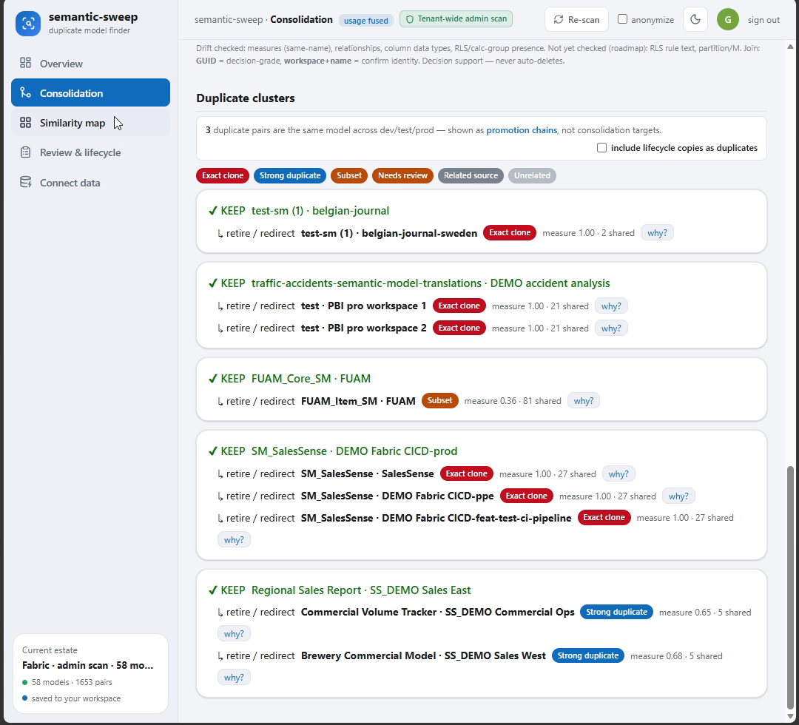
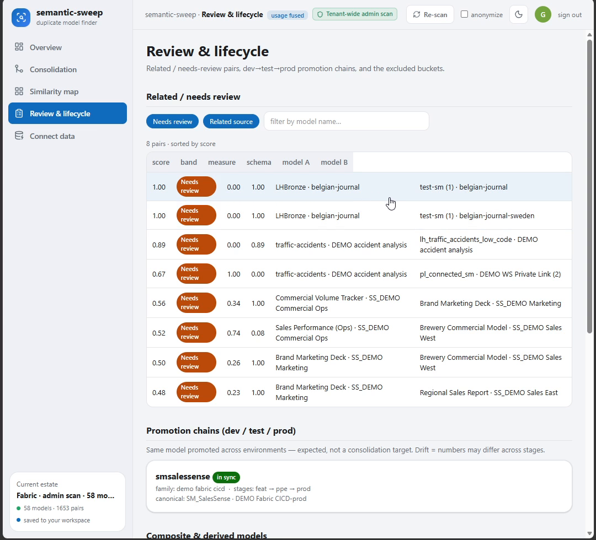
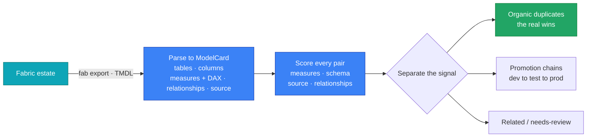

<div align="center">

# 🧭 semantic-sweep

### Find duplicate Power BI semantic models across your whole estate — in one place.

Scan every model in a Microsoft Fabric / Power BI tenant, score the near-duplicates with
**transparent evidence**, and get ranked, human-in-the-loop consolidation calls.
The scoring engine runs **entirely in your browser**; ships as a
[Rayfin](https://github.com/microsoft/rayfin) Fabric App with Entra SSO.

</div>

https://github.com/user-attachments/assets/8668590a-1156-490a-a32c-dffef5405afc

---

## What is semantic-sweep?

A Power BI estate sprawls. The same "Sales" model gets copied across teams, promoted
dev → test → prod, and rebuilt from the same source by three different people. Nobody can see which
models are genuinely duplicated, which are just lifecycle copies, and which are safe to retire.

semantic-sweep gives you that picture. Point it at your estate and it reads every semantic model,
scores **all model pairs** on a multi-facet similarity — measures + DAX, schema, source and
relationships — then separates the real duplicates from promotion chains and shared-source
coincidences, with the **evidence for every call**.

> **Decision support, not auto-deletion.** semantic-sweep ranks and explains; a human confirms.

## A tour

### Estate overview
One glance: models scanned, pairs scored, duplicate clusters, retirement candidates — and the top
consolidation candidates ranked by evidence band (exact clone → strong duplicate → subset → needs review).



### Consolidation worklist
Every cross-team duplicate as a ranked, evidence-backed call — **keep** vs **retire / redirect** — with
the specific conflict (measure logic differs, data types differ), a confidence score, and one-click CSV export.


### Why are these similar?
No black box. Click any pair for the **facet breakdown** — measures, schema, logical/physical source,
relationships — and the exact **matched measures** that drove the score.



### Duplicate clusters, kept apart from lifecycle
Genuine cross-team duplicates are grouped into clusters and held **separate from promotion chains**
(dev → test → prod copies of one model), so a healthy pipeline never gets flagged for "consolidation".



### Facet scoring & review
The full pair table — score, band, and per-facet measure/schema contribution — for related and
needs-review pairs, plus promotion chains and the excluded system-generated buckets.



---

## How it works



1. **Inventory + extract** every semantic model in a Fabric tenant to TMDL (`scripts/`).
2. **Parse** each model to a `ModelCard` — tables, columns, measures + DAX, relationships, source.
3. **Score** every pair with a multi-facet similarity, using **weighted lexical DAX features**
   (transparent, not opaque embeddings).
4. **Separate the signal types** so you act on the right thing:
   - **Organic duplicate candidates** — genuine cross-team duplication (the real wins).
   - **Promotion chains** — dev/test/prod copies of one model (+ drift), *not* consolidation targets.
   - **Related / needs-review** — shared source only, or mixed evidence.

   System-generated models (Usage Metrics, default lakehouse models) are bucketed separately.

## Usage
```bash
uv venv --python 3.11
uv sync
uv run python -m semantic_sweep.cli --models models --out out   # -> report.md, results.json, matrix
uv run python scripts/build_dashboard.py                        # -> out/dashboard.html (shareable overview)
uv run python scripts/build_dashboard.py --anonymize --out out/dashboard_client.html  # external-safe
```

Re-extract the estate (needs `az login` + `fab`):
```bash
uv run python scripts/enumerate_estate.py     # -> inventory.json
uv run python scripts/export_models.py         # -> models/
```

Seed a labeled near-duplicate control set into a tenant (needs an active capacity):
```bash
uv run python scripts/make_seed_models.py      # -> seed_models/ (deployable TMDL)
uv run python scripts/deploy_seed.py           # create SS_DEMO workspaces + import (writes manifest)
uv run python scripts/teardown_seed.py         # remove everything afterwards
```

## Interactive app (fully browser-side)
A React + TypeScript SPA in `app/` runs the **entire scoring engine client-side** (ported to TS,
**parity-checked** against the Python engine) — drop a `.zip` of your exported TMDL and it scores in
the browser; **nothing leaves the machine**. Fancy UI: KPIs, an interactive similarity **heatmap**,
consolidation-cluster cards, promotion chains, needs-review, and a **"why" drill-down** (facet bars +
matched measures + side-by-side DAX diff). Ships as a single self-contained HTML.
```bash
cd app
npm install
npm run validate    # confirm TS engine == Python engine on the committed sample_models/ fixture
npm run build       # -> app/dist/index.html (single self-contained file)
```
Also shipped as a **Rayfin Fabric App** (`rayfin-app/`) — managed hosting + Entra SSO for live,
in-tenant estate scans (that's the app shown in the tour above).

## Layout
```
semantic_sweep/   Python engine — parser · measures · lifecycle · score · report · cli
engine/           TypeScript engine — parity-checked against the Python engine
scripts/          enumerate_estate · export_models · make_sample_models · make_seed_models
                  · deploy_seed · teardown_seed · build_dashboard · make_parity_fixture
sample_models/    synthetic, graded-overlap models for scoring calibration (committed)
seed_models/      synthetic, deployable near-duplicate control set (committed)
composite_demo/   synthetic composite (chained) semantic models for link detection
models/           exported TMDL (gitignored — real tenant metadata, never committed)
out/              report.md · results.json · similarity_matrix.csv (gitignored)
tests/            DAX sanity matrix · smoke tests · calibration · precision
                  · fixtures/ (committed sample_models.results.json — TS/Python parity reference)
app/              React+TS SPA — drop-a-zip, fully client-side engine + UI; single-file build
rayfin-app/       Rayfin Fabric App — live estate scan (Entra SSO, admin + per-user paths)
```

## Performance
Pure compute for 35 models / 595 pairs ≈ **2.6 s** (parse 1.3 s, score 1.4 s ≈ 2.3 ms/pair,
report 3 ms) — excludes `fab export` network I/O. Scoring is O(n²); for hundreds+ of models add the
deferred LSH blocking stage.

## Notes
- **Decision support, not auto-deletion** — flag candidates; a human confirms.
- `models/` and `out/` are gitignored: they hold real tenant metadata.
- MVP is **pure stdlib** (no embeddings/numpy) for portability; deferred enhancements include
  LSH blocking, embeddings, Hungarian matching, and a deployment-pipeline API.
